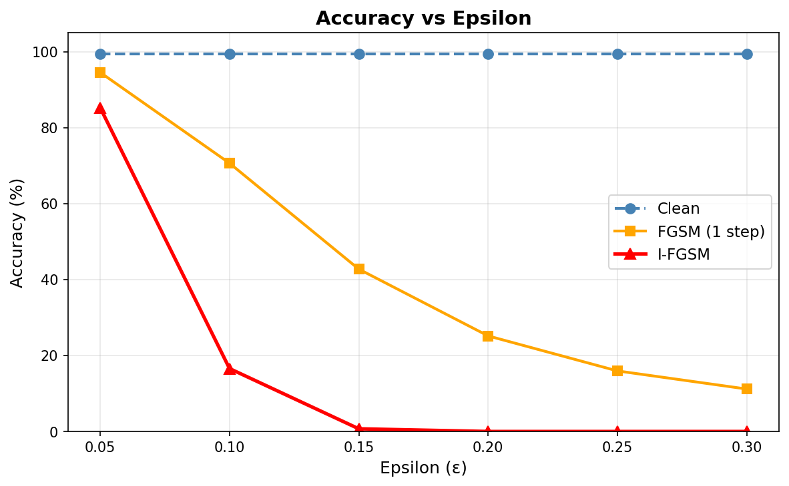
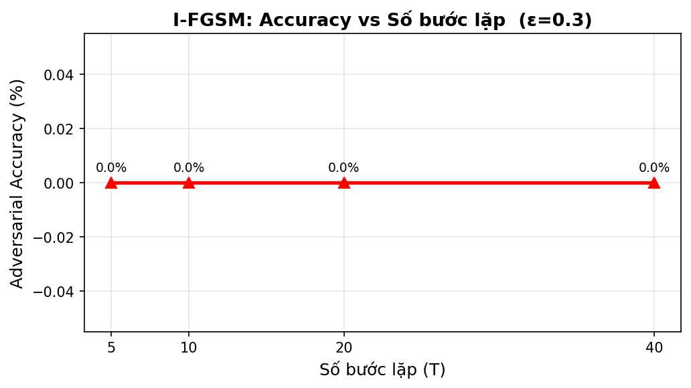
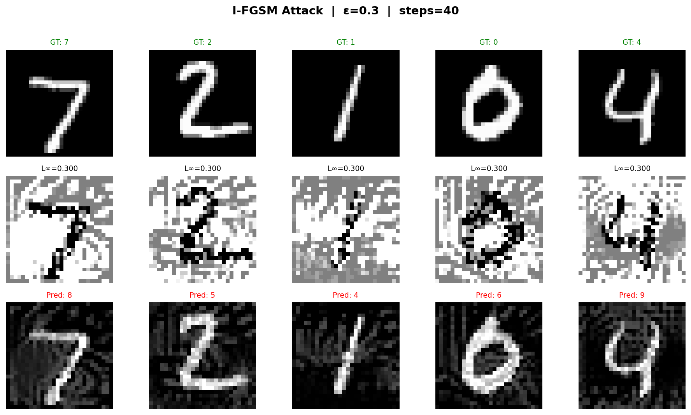
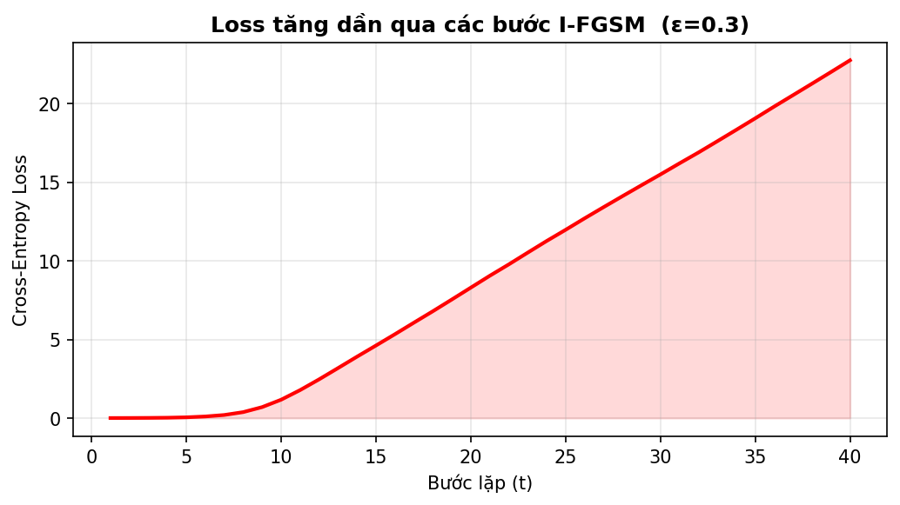

# I-FGSM Adversarial Attack — Image Classifier

Implementation of the **I-FGSM (Iterative Fast Gradient Sign Method)** adversarial attack on MNIST and CIFAR-10 image classifiers.

> Paper: *Adversarial Examples in the Physical World* — Kurakin, Goodfellow & Bengio (2016)
> https://arxiv.org/abs/1607.02533

---

## What is I-FGSM?

I-FGSM is an iterative extension of the one-step FGSM attack. Instead of taking a single large gradient step, it takes many small steps and clips the perturbation at each iteration to stay within the ε-ball.

**Update rule:**

```
x₀    = x
xₜ₊₁ = Clip_{x,ε} [ xₜ + α · sign(∇ₓ J(θ, xₜ, y)) ]
```

| Symbol | Meaning |
|---|---|
| `ε` | Maximum perturbation magnitude (L∞ norm) |
| `α` | Step size per iteration = ε / T |
| `T` | Number of iterations |
| `Clip` | Keeps perturbation in [-ε, +ε] and pixels in [0, 1] |

I-FGSM is significantly stronger than FGSM at the same ε budget because iterative refinement finds a more adversarial direction than a single gradient step.

---

## Project Structure

```
ifgsm_project/
│
├── attacks/
│   ├── fgsm.py               # FGSM baseline (1 step)
│   └── ifgsm.py              # I-FGSM (N iterative steps)
│
├── models/
│   ├── cnn.py                # SimpleCNN (used for MNIST & CIFAR-10)
│   └── resnet.py             # ResNet-18 wrapper
│
├── utils/
│   ├── data_loader.py        # MNIST / CIFAR-10 dataloaders
│   ├── trainer.py            # Training loop with checkpoint saving
│   ├── evaluator.py          # Evaluation under adversarial attack
│   └── visualization.py      # Plot generation
│
├── experiments/
│   ├── exp1_epsilon.py       # Sweep ε, measure accuracy drop
│   ├── exp2_steps.py         # Sweep T (num steps), measure accuracy drop
│   └── exp3_visualize.py     # Visualize clean vs. adversarial images
│
├── configs/
│   └── config.yaml           # All hyperparameters in one place
│
├── results/
│   ├── figures/              # Generated plots (.png)
│   └── logs/                 # Experiment metrics (.json)
│
├── tests/
│   └── test_ifgsm.py         # Unit tests (pytest)
│
├── train.py                  # Standalone training script
└── main.py                   # Full pipeline (train + all experiments)
```

---

## Setup

```bash
# Clone the repo
git clone https://github.com/wotttoo/ifgsm-adversarial-attacks.git
cd ifgsm-adversarial-attacks

# Create a virtual environment (recommended)
python -m venv venv
source venv/bin/activate       # Linux/Mac
# venv\Scripts\activate        # Windows

# Install dependencies
pip install -r requirements.txt
```

---

## Usage

```bash
# Run the full pipeline: train + all 3 experiments
python main.py

# Skip training (use existing checkpoint)
python main.py --skip-train

# Run specific experiments only
python main.py --skip-train --exp 1 3

# Train on CIFAR-10 instead of MNIST
python train.py --dataset CIFAR10

# Run unit tests
python -m pytest tests/ -v
```

---

## Model & Training

| Setting | Value |
|---|---|
| Dataset | MNIST (54,000 train / 6,000 val / 10,000 test) |
| Model | SimpleCNN |
| Optimizer | Adam (lr=0.001, weight_decay=1e-4) |
| Scheduler | StepLR (step=10, γ=0.1) |
| Epochs | 20 |
| Batch size | 64 |
| **Best val accuracy** | **98.98%** |

---

## Experiment Results

### Exp 1 — Accuracy vs Epsilon (ε)

Fixed: T=40 steps. Evaluated on MNIST test set.

| ε | Clean Acc | FGSM Acc | I-FGSM Acc | I-FGSM Drop |
|---|---|---|---|---|
| 0.05 | 99.45% | 94.53% | 85.23% | -14.22% |
| 0.10 | 99.45% | 70.63% | 16.56% | -82.89% |
| 0.15 | 99.45% | 42.73% | 0.70% | -98.75% |
| 0.20 | 99.45% | 25.16% | 0.00% | -99.45% |
| 0.25 | 99.45% | 15.94% | 0.00% | -99.45% |
| 0.30 | 99.45% | 11.17% | 0.00% | -99.45% |

Key takeaway: I-FGSM with ε=0.10 reduces accuracy from 99.45% to 16.56% — far more powerful than single-step FGSM (70.63%) at the same budget. By ε=0.20, accuracy reaches 0%.



---

### Exp 2 — Accuracy vs Number of Steps (T)

Fixed: ε=0.3. Evaluated on MNIST test set.

| T (steps) | I-FGSM Acc |
|---|---|
| 5 | 0.00% |
| 10 | 0.00% |
| 20 | 0.00% |
| 40 | 0.00% |

At ε=0.3, even 5 steps is already enough to reach 0% accuracy — the attack saturates quickly at high ε values. To observe the step-count effect, use a smaller ε (e.g. 0.05–0.1).



---

### Exp 3 — Adversarial Example Visualization

Side-by-side view of original images, perturbation (×10 amplified), and adversarial images with model predictions.




---

## Configuration

All hyperparameters are in `configs/config.yaml`:

```yaml
dataset:
  name: "MNIST"           # MNIST | CIFAR10
  batch_size: 64

model:
  name: "SimpleCNN"       # SimpleCNN | ResNet18

train:
  epochs: 20
  lr: 0.001
  optimizer: "Adam"
  scheduler: "StepLR"

attack:
  epsilon: 0.3            # max perturbation
  num_steps: 40           # iterations T
  alpha: 0.01             # step size (null → auto = epsilon/num_steps)
  targeted: false

experiment:
  epsilon_list: [0.05, 0.1, 0.15, 0.2, 0.25, 0.3]
  steps_list: [5, 10, 20, 40]
  num_samples: 1000
  device: "cuda"          # cuda | cpu | mps
```

---

## References

| Paper | Link |
|---|---|
| FGSM — Goodfellow et al. (2015) | https://arxiv.org/abs/1412.6572 |
| **I-FGSM** — Kurakin et al. (2016) | https://arxiv.org/abs/1607.02533 |
| MI-FGSM — Dong et al. (2018) | https://arxiv.org/abs/1710.06081 |
| DI-FGSM — Xie et al. (2019) | https://arxiv.org/abs/1803.06978 |
